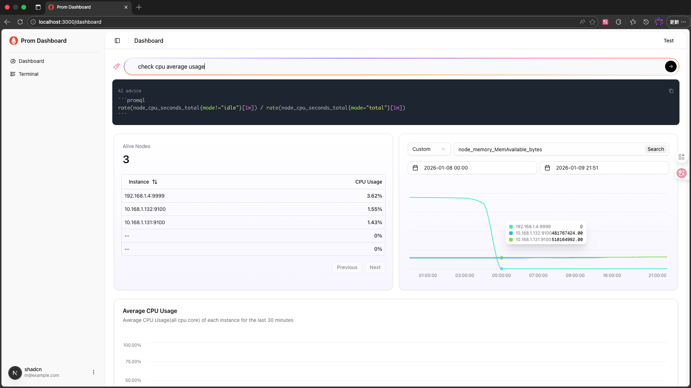
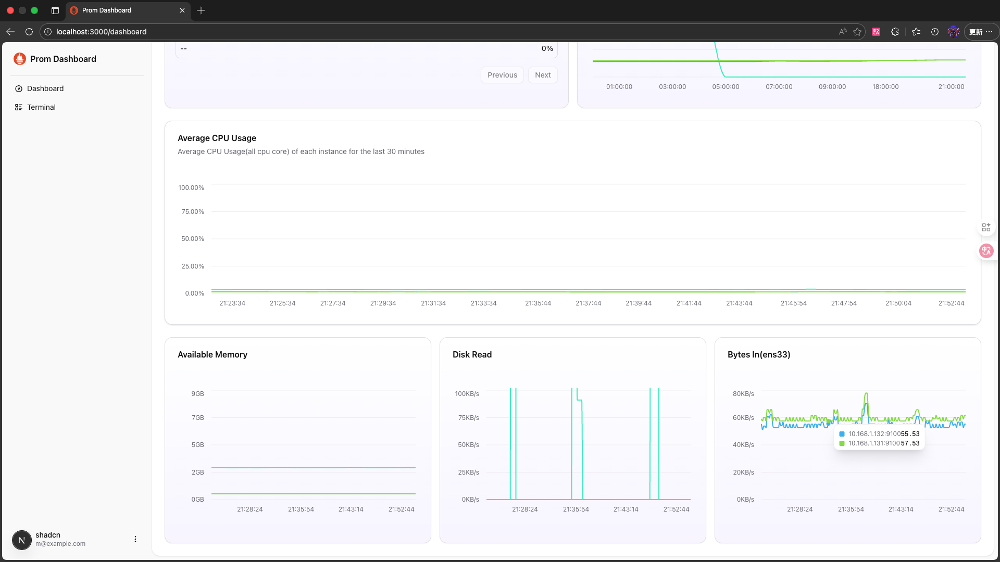
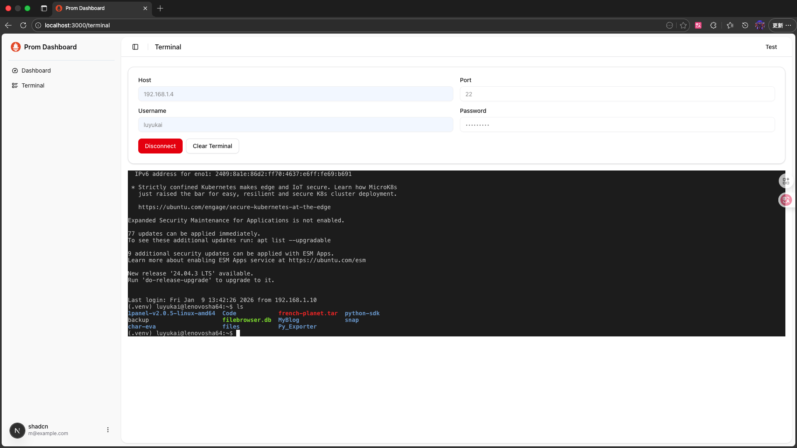

# Prom Dashboard

This is a dashboard project for prometheus(simiar to grafana).

## Features

- [x] AI PromQL Advice - AI generated PromQL advice based on GLM 4 air

- [x] Metric Query

- [x] SSH Terminal


You can watch our demo video under `demo/demo.mp4`

## Quick Start

### Run Backend

The backend is Based on FastAPI, using uv to manage the project.

#### 1. Set up environment

Install uv (if you didn't install uv yet)

```bash
pip install uv
```

------------------------------------------------------------------------------------------------
**ex.** How to change source for uv(for China mainland)

create uv global config file:

- Windows:
create `/uv/uv.toml` under `%APPDATA%/`
- Linux/MacOS:
create `/uv/uv.toml` under `~/.config/`

add following lines to `uv.toml`:

```
[[index]]
url = "https://mirrors.aliyun.com/pypi/simple/"
default = true
# 或使用清华源
# url = "https://pypi.tuna.tsinghua.edu.cn/simple/"
```
------------------------------------------------------------------------------------------------

Then, run `uv sync` under `/backend`.

#### 2. Run Backend

```bash
backend/ $ uv run app/main.py
```

Then, open `http://localhost:8000/docs` to see the API documentation

#### 3. Config

We use pydantic setting to config the backend.

```bash
# setup your prometheus location
export PROMETHEUS_URL="your prometheus url"
# setup your glm api key
export ZAI_API_KEY="your glm api key"
```

See `app/core/config.py` for more details.

### Run Frontend

The frontend is based on Next.js. Under `/frontend`, run

#### 1. Install dependencies

```bash
npm install
```

#### 2. Run Frontend

```bash
npm run dev
```

#### 3. Config

Edit `src/lib/config.js` to change the backend url.

## License

This project is licensed under the MIT License - see the [LICENSE](LICENSE) file for details.